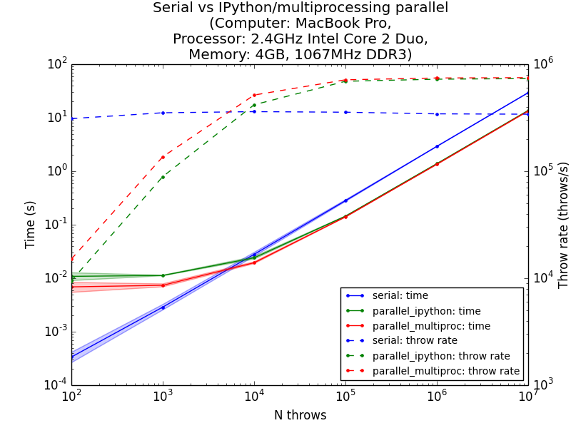

# Comparison of serial and parallel computation speeds in python

## Description
The code contained in hw9.py runs a simulation to approximate pi using Monte Carlo sampling. The code is run in three different ways:
	
	1. Serial computation
	2. Parallel computation using the IPython cluster API
	3. Parallel computation using the multiprocessing module

The simulation is run with 6 different iteration numbers (10^2 to 10^7) and the time-to-completion and simulation rate (number of iterations/second) are plotted to compare how the three different methods scale to larger iteration numbers.

## How to run
First, you should initiate an IPython cluster by entering the following code into the terminal.
> ipcluster start

When the cluster has intialized, you can run the code by entering the following into a separate terminal window.
> python hw9.py

The code finished in about 2 minutes on my MacBook Pro.

